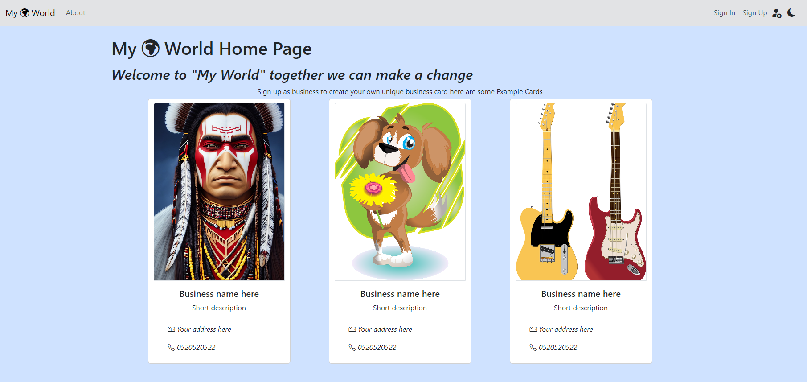

# My World

## <u>Description</u>

This is a single page application based on React, in this project we use the power of React to shape and create functional components easily.
This is a web site for creating an editing electronic business cards.

## <u>Technologies in use</u>

- React, special features in use: useState, useEffect, react-router-dom,useContext, custom hooks
- Bootstrap 5.
- Bootstrap icons.
- MongoDb, for running the server
- Formik, used to manage the form inputs.
- Joi. used for validation of inputs.
- Axios, used for managing http requests.
- Toastify, used for popping massages.
- React router dom, used for url options.

## <u>Get started</u>

1. Make sure you have mongDb installed up and running. you can download it from here https://www.mongodb.com/try/download/shell.
1. - open a new terminal in your VScode
   - open the app server path by typing "cd react-project-server",
   - once in the server library download the node-modules by typing "npm i".
   - run the "npm run start" command or "npm run dev" for developer options.
1. - open another terminal in your VScode.
   - open the app front path by typing "cd react-project-front".
   - once in the front library download the node-modules by typing "npm i".
    - run the "npm run start" command to run the app on local host.

## <u>Website operation</u>

- You can sign in as regular user or as business user by checking the sign as business checkbox.
- Business users can create e-business card, edit, delete and view enlarged specific card.
- Home page will show 3 example cards for all user, but for a business user who has cards it will show the last 3 cards he created but if he don't have any card he will be invited to add one and will also see the 3 example cards.
- In the navigation menu at the right top side of the screen you can press the dark/light mode button, mode will be saved in local storage.
- A sign/not sign state will be show near the mode button.
- The site is fully responsive for different screen sizes.

## <u>Preview</u>
